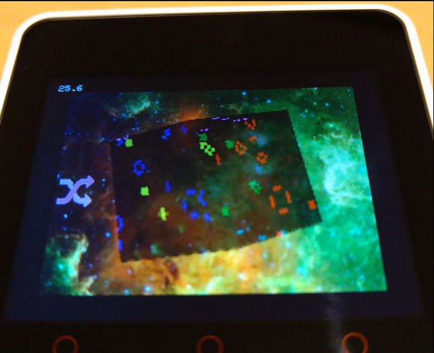

# GameOfLifeOnCube

[English](#overview)

## 概要

立方体の各面でライフゲームが動いています。  
@e-perulatus さんの[オリジナル版](https://github.com/e-perulatus/GameOfLifeOnCube)では Core2 のみの動作でしたが、M5Unified ベースに改造して Core2,CoreS3 で動作するようになりました。

## platformio.ini

|env|Description|
|---|---|
|[env:Core2]|Using M5Unified and M5GFX for Core2|
|[env:CoreS3]|Using M5Unified and M5GFX for CoreS3|
|[env:m5stack-core2]|Original settings (Using M5Core2 and LovyanGFX) |

## 操作方法

* ボタン A: 選択
* ボタン B: 決定
* ボタン C: キャンセル
* タッチ操作: キューブの回転

(A,B,C ボタンは CoreS3 では画面下部の[ソフトウェアボタン](https://github.com/GOB52/gob_unifiedButton)で機能します)

## 動作環境

M5Core2, CoreS3 で動作確認しています。

## 依存ライブラリ

### M5Unified / M5GFX 版
* [m5stack/M5Unified](https://github.com/m5stack/M5Core2)
* [m5stack/M5GFX](https://github.com/m5stack/M5GFX)
* [gob/gob_unifiedButton](https://github.com/GOB52/gob_unifiedButton)

### Original 版
* [m5stack/M5Core2](https://github.com/m5stack/M5Core2)
* [lovyan03/LovyanGFX](https://github.com/lovyan03/LovyanGFX)

---

## Overview

"Game of Life" inhabited on each face of the cube.  
The [original version](https://github.com/e-perulatus/GameOfLifeOnCube) by @e-perulatus worked only with Core2, but I modified it based on M5Unified to work with Core2 and CoreS3.

## platformio.ini

|env|Description|
|---|---|
|[env:Core2]|Using M5Unified and M5GFX for Core2|
|[env:CoreS3]|Using M5Unified and M5GFX for CoreS3|
|[env:m5stack-core2]|Original settings (Using M5Core2 and LovyanGFX) |

## Operation
* Button A : Select
* Button B : Decide
* Button C : Cancel
* Touch operation : cube rotation

(The A, B, and C buttons function in CoreS3 with the [software buttons](https://github.com/GOB52/gob_unifiedButton) at the bottom of the screen)

## operating environment

Operation has been confirmed on M5Core2 and CoreS3.

## Required libraries

### M5Unified / M5GFX version
* [m5stack/M5Unified](https://github.com/m5stack/M5Core2)
* [m5stack/M5GFX](https://github.com/m5stack/M5GFX)
* [gob/gob_unifiedButton](https://github.com/GOB52/gob_unifiedButton)

### Original version
* [m5stack/M5Core2](https://github.com/m5stack/M5Core2)
* [lovyan03/LovyanGFX](https://github.com/lovyan03/LovyanGFX)

